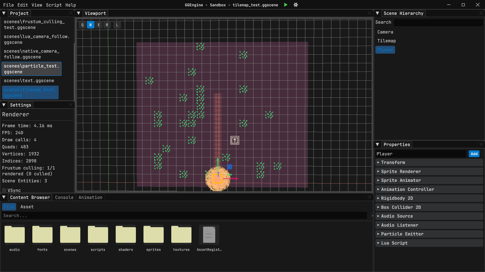

# GGEngine

A 2D game engine written in Rust with a Vulkan rendering backend. Build scenes in a visual editor, script gameplay in Lua, and ship standalone builds.



---

## Features

**Visual Scene Editor** with dockable panels, transform gizmos, tilemap painting, mouse picking, undo/redo, and auto-save recovery.

**Entity Component System** built on [hecs](https://crates.io/crates/hecs) with parent-child hierarchies, sprites, circles (SDF), MSDF text, tilemaps, cameras, and audio sources.

**Lua Scripting** via LuaJIT with per-entity isolated environments, hot reload on save, configurable fields exposed in the editor, collision callbacks, and timers.

**2D Physics** powered by [rapier2d](https://rapier.rs/) with rigid bodies, box/circle colliders, collision layers, fixed-timestep simulation, and interpolation.

**Vulkan Renderer** with bindless textures (4096 slots), batched quads/circles/lines/text, GPU particle system (compute shader), instanced sprite rendering with GPU-driven animation, and runtime shader hot-reload.

**Sprite Animation** with named clips, sprite sheet editor timeline, per-entity CPU animation, GPU-driven instanced animation, and data-driven animation state machines.

**Audio** via [kira](https://docs.rs/kira) supporting WAV/OGG/MP3/FLAC with volume, pitch, looping, streaming playback, and spatial audio with camera-relative panning.

**Asset System** with UUID-based handles, a persistent YAML registry, async background loading, and LRU texture caching.

**Multi-threaded Jobs** using rayon with an Extract-Process-Writeback pattern for parallel transform computation, animation ticking, and frustum culling.

---

## Prerequisites

- **Rust** -- Install via [rustup](https://www.rust-lang.org/tools/install)
- **Vulkan SDK** -- Install from [LunarG](https://vulkan.lunarg.com/). Ensure `glslc` is on your `PATH` (shaders compile at build time)

## Quick Start

```sh
git clone <repo-url> && cd GGEngine
cargo build
cargo run -p gg_editor
```

On first launch, the editor opens a **Project Hub** where you can create a new project or open an existing one.

```sh
# Open an existing project directly
cargo run -p gg_editor -- path/to/MyGame.ggproject
```

## Building

```sh
cargo build                    # Development (debug + Vulkan validation layers)
cargo build --release          # Release (optimized, profiling enabled)

# Distribution (optimized, profiling stripped, Lua scripting kept)
cargo build --profile dist --no-default-features --features lua-scripting
```

## Testing

```sh
cargo test                          # All tests
cargo test -p gg_engine             # Engine crate only
cargo test -p gg_engine -- test_fn  # Single test
cargo fmt                           # Format
cargo clippy --all-targets          # Lint
```

---

## The Editor

```
+----------+--------------+------------------+
| Project  |              | Scene Hierarchy  |
+----------+   Viewport   +------------------+
| Settings |              |    Properties    |
+----------+--------------+                  |
|     Content Browser     |                  |
+-------------------------+------------------+
```

| Panel | What it does |
|-------|-------------|
| **Viewport** | Scene view with transform gizmos, grid, mouse picking, tilemap painting |
| **Scene Hierarchy** | Entity tree with drag-and-drop reparenting and search |
| **Properties** | Component inspector -- sprites, physics, audio, scripting, animation, tilemaps |
| **Content Browser** | File/asset browser with import, drag-and-drop, and right-click menus |
| **Settings** | Renderer stats, VSync, physics collider viz, grid, shader reload, theme |
| **Animation Timeline** | Sprite sheet clip editor with frame ruler, playhead, and pick mode |
| **Game Viewport** | Game camera preview (no gizmos or picking) |
| **Console** | Color-coded log viewer with level filtering |
| **Project** | Scene list browser |

### Keyboard Shortcuts

| Action | Shortcut |
|--------|----------|
| New Scene | Ctrl+N |
| Open Scene | Ctrl+O |
| Save | Ctrl+S |
| Save As | Ctrl+Shift+S |
| Undo / Redo | Ctrl+Z / Ctrl+Y |
| Duplicate | Ctrl+D |
| Delete | Del |
| Gizmo: None / Translate / Rotate / Scale | Q / W / E / R |
| Snap (while using gizmo) | Hold Ctrl |
| Reload Lua Scripts | Ctrl+R |
| Toggle Eraser (tilemap) | X |

### Play Mode

Press the **Play** button to test your game. The editor snapshots the scene, initializes physics and Lua scripts, and runs the game loop. Press **Stop** to revert to your saved state. **Simulate** runs physics only (no scripts) with the editor camera still active.

---

## Lua Scripting

Attach `.lua` scripts to entities. Each script runs in an isolated environment with access to the `Engine` API.

```lua
fields = {
    speed = 5.0,
    jump_force = 10.0,
}

function on_create()
    print("Player spawned!")
end

function on_update(dt)
    local vx = 0
    if Engine.is_key_down("D") then vx = fields.speed end
    if Engine.is_key_down("A") then vx = -fields.speed end
    Engine.set_linear_velocity(entity_id, vx, 0)
end

function on_fixed_update(dt)
    if Engine.is_key_pressed("Space") then
        Engine.apply_impulse(entity_id, 0, fields.jump_force)
    end
end

function on_collision_enter(other_uuid)
    local name = Engine.get_entity_name(other_uuid)
    print("Hit: " .. name)
end
```

The `fields` table is editable per-entity in the Properties panel -- override values without changing code. Scripts hot-reload on save during play mode.

### Engine API Overview

| Category | Functions |
|----------|-----------|
| **Transform** | `get_translation`, `set_translation`, `get_rotation`, `set_rotation`, `get_scale`, `set_scale` |
| **Input** | `is_key_down`, `is_key_pressed`, `is_mouse_button_down`, `is_mouse_button_pressed`, `get_mouse_position` |
| **Physics** | `apply_impulse`, `apply_force`, `get_linear_velocity`, `set_linear_velocity`, `get_angular_velocity`, `set_angular_velocity` |
| **Entity** | `create_entity`, `destroy_entity`, `find_entity_by_name`, `get_entity_name`, `has_component` |
| **Hierarchy** | `set_parent`, `detach_from_parent`, `get_parent`, `get_children` |
| **Animation** | `play_animation`, `stop_animation`, `is_animation_playing`, `set_animation_speed` |
| **Audio** | `play_sound`, `stop_sound`, `set_volume`, `set_panning` |
| **Tilemap** | `set_tile`, `get_tile`, `TILE_FLIP_H`, `TILE_FLIP_V` |
| **Timers** | `set_timeout`, `set_interval`, `clear_timer` |
| **Math** | `vector_dot`, `vector_cross`, `vector_normalize` |
| **Cross-Entity** | `get_script_field`, `set_script_field` |

See [`gg_docs/07-scripting.md`](gg_docs/07-scripting.md) for the complete API reference with signatures and key name tables.

---

## Shipping a Game

Build the standalone player and bundle it alongside your project:

```sh
cargo build --profile dist -p gg_player --no-default-features --features lua-scripting
```

```
dist/
├── gg_player.exe
├── MyGame.ggproject
└── assets/
    ├── AssetRegistry.ggregistry
    ├── scenes/
    ├── textures/
    ├── scripts/
    └── audio/
```

The player auto-detects `.ggproject` files next to the executable, or accepts a path as a CLI argument. Press `V` at runtime to toggle VSync.

```sh
# Run with options
gg_player.exe MyGame.ggproject --width 1920 --height 1080 --vsync
```

---

## Workspace

| Crate | Type | Lines | Description |
|-------|------|-------|-------------|
| `gg_engine` | lib | ~28,300 | Core engine -- Vulkan renderer, ECS, physics, scripting, audio, assets, jobs |
| `gg_editor` | bin | ~12,100 | Scene editor -- dockable panels, gizmos, content browser, animation timeline |
| `gg_player` | bin | ~350 | Standalone game runtime -- loads `.ggproject`, runs start scene |
| `gg_sandbox` | bin | ~630 | Testing sandbox for engine features and jobs stress tests |
| `gg_tools` | bin | ~460 | CLI for analyzing Chrome Tracing JSON profiles (+ flame graph SVG) |

### Project Structure

```
GGEngine/
├── gg_engine/src/
│   ├── renderer/          # Vulkan rendering (context, swapchain, batching, textures, cameras, text, particles)
│   │   └── shaders/       # GLSL sources (auto-compiled to SPIR-V)
│   ├── scene/             # ECS, components, physics, audio, Lua scripting, animation, hierarchy
│   ├── asset/             # UUID-based asset system (registry, manager, async loader)
│   └── jobs/              # Multi-threaded job system (thread pool, parallel helpers, command buffer)
├── gg_editor/src/
│   ├── panels/            # Editor UI panels (viewport, hierarchy, properties, content browser, etc.)
│   │   └── properties/    # Component inspectors (sprite, physics, audio, scripting, tilemap, etc.)
│   └── ...                # Hub, file ops, undo, gizmos, playback, camera, settings
├── gg_player/src/         # Standalone game runtime
├── gg_sandbox/src/        # Testing sandbox
├── gg_tools/src/          # Profile analyzer
└── gg_docs/               # Full documentation (12 topic files)
```

---

## Documentation

The [`gg_docs/`](gg_docs/) directory contains detailed documentation for every subsystem:

| Document | Covers |
|----------|--------|
| [`01-build-and-tools.md`](gg_docs/01-build-and-tools.md) | Build profiles, dependencies, profiling, shader compilation |
| [`02-ecs.md`](gg_docs/02-ecs.md) | Scene, entities, components, hierarchy, queries |
| [`03-editor.md`](gg_docs/03-editor.md) | Editor panels, undo, auto-save, play/stop, gizmos, tilemap painting |
| [`04-engine-core.md`](gg_docs/04-engine-core.md) | Application trait, lifecycle, layers, input, events, egui integration |
| [`05-physics.md`](gg_docs/05-physics.md) | rapier2d integration, fixed timestep, collisions, collision layers |
| [`06-rendering.md`](gg_docs/06-rendering.md) | Vulkan renderer, batching, bindless textures, MSDF text, GPU particles |
| [`07-scripting.md`](gg_docs/07-scripting.md) | Lua API reference, script lifecycle, field overrides, error handling |
| [`08-serialization.md`](gg_docs/08-serialization.md) | YAML scene format, intermediate structs, UUID system |
| [`09-assets.md`](gg_docs/09-assets.md) | Asset handles, registry, async loading, LRU cache |
| [`10-audio.md`](gg_docs/10-audio.md) | kira integration, spatial audio, streaming, Lua audio API |
| [`11-player-and-project.md`](gg_docs/11-player-and-project.md) | Project system, .ggproject format, standalone player |
| [`12-jobs-system.md`](gg_docs/12-jobs-system.md) | Multi-threaded ECS, EPW pattern, parallelized systems |

---

## Profiling

The engine includes a built-in Chrome Tracing profiler (feature-gated, on by default).

1. Open the editor and go to **Settings > Capture Trace**
2. Interact with your scene for a few seconds
3. Click **Stop Capture**
4. Analyze with the included CLI tool:

```sh
cargo run -p gg_tools -- target/debug/gg_profile_runtime.json
cargo run -p gg_tools -- --flamegraph target/debug/gg_profile_runtime.json  # SVG flame graph
```

Or open the JSON directly in `chrome://tracing` or `edge://tracing`.

---

## Debugging (VS Code)

1. Install the [C/C++ extension](https://marketplace.visualstudio.com/items?itemName=ms-vscode.cpptools)
2. Select **Debug GGEditor** or **Debug GGSandbox** from the launch dropdown
3. Press **F5**

## Platform

Primary target is **Windows 11** with a Vulkan 1.3+ GPU. macOS is conditionally supported.

## License

MIT
